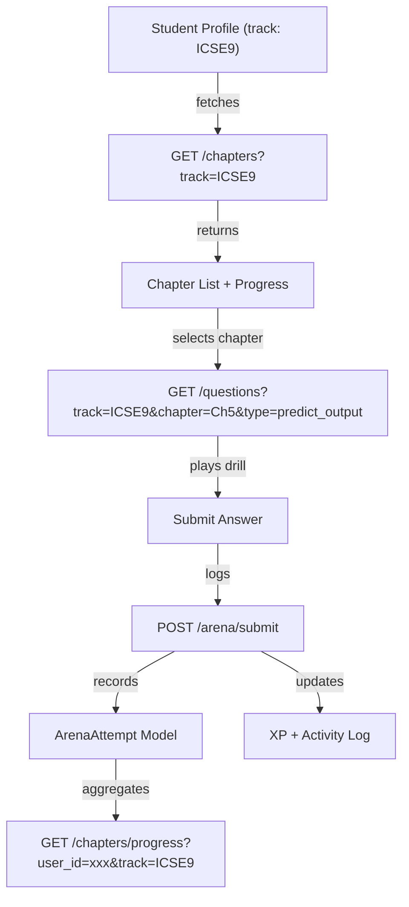

# Implementation Plan: Chapter-Wise Arena with ICSE Syllabus Questions, Progress Tracking & Mistake Logging

This plan transforms the Predict the Output drill from a flat question list into a **chapter-wise, progress-tracked arena** with 10 medium-difficulty ICSE exam-level questions per chapter, mistake logging, and multi-track support.

## User Review Required

> [!IMPORTANT]
> **This is a major feature upgrade** that touches the database schema, seed script, backend API, and frontend UI. The database will be re-seeded (existing question data will be reset).

> [!WARNING]
> **Breaking change**: The `seed.py` script does `drop_all` + `create_all`, so existing user profiles and activity history will be lost when re-seeding. We can add a flag to only reseed questions if you want to preserve user data.

## Open Questions

> [!IMPORTANT]
> 1. **Class 10 & APCSA content**: For this iteration, should I seed placeholder chapter structures for ICSE10 and APCSA (with fewer questions), or should we focus exclusively on ICSE9 first and add others later?
> 2. **Mistake analytics page**: Should mistake logs be viewable from the dashboard (a new "Weak Areas" card), or only from within the chapter progress view?
> 3. **Question ordering**: Should questions within a chapter be served in a fixed order or randomized each session?

---

## Architecture Overview



---

## Proposed Changes

### 1. Database Schema Changes

#### [MODIFY] [models.py](file:///c:/Users/ASUS/OneDrive/Desktop/vscProgram/JavaBloom/backend/models.py)

Add two new fields to `Question` and a new `ArenaAttempt` model:

```python
# Add to Question model
chapter_number = Column(Integer)  # e.g. 5 for "Ch 5: Operators"
difficulty = Column(String(20), default="medium")  # easy, medium, hard

# New model for tracking per-question attempts
class ArenaAttempt(Base):
    __tablename__ = "arena_attempts"
    
    id = Column(String(50), primary_key=True, default=generate_uuid)
    user_id = Column(String(50), ForeignKey("profiles.id", ondelete="CASCADE"))
    question_id = Column(String(50), ForeignKey("questions.id", ondelete="CASCADE"))
    track = Column(String(20))
    chapter_number = Column(Integer)
    user_answer = Column(Text)           # What the student typed
    is_correct = Column(Boolean)
    time_taken_ms = Column(Integer, nullable=True)  # How long they took
    attempted_at = Column(String(50))    # ISO timestamp
    
    profile = relationship("Profile")
    question = relationship("Question")
```

**Why `ArenaAttempt`?** This is the core of mistake logging. Every submission is recorded — correct or wrong — so we can:
- Calculate per-chapter completion % (`correct_unique / total_in_chapter`)
- Show which questions were answered wrong (and how many times)
- Power future "Weak Areas" analytics

---

### 2. Backend API Changes

#### [MODIFY] [schemas.py](file:///c:/Users/ASUS/OneDrive/Desktop/vscProgram/JavaBloom/backend/schemas.py)

Add request/response schemas:

```python
class ArenaSubmitRequest(BaseModel):
    user_id: str
    question_id: str
    user_answer: str
    time_taken_ms: Optional[int] = None

class ChapterProgressResponse(BaseModel):
    chapter_number: int
    chapter_title: str
    total_questions: int
    correct_count: int      # Unique questions answered correctly
    attempted_count: int    # Unique questions attempted
    mistakes: int           # Total wrong attempts
    completion_pct: float   # correct_count / total_questions * 100
```

#### [MODIFY] [main.py](file:///c:/Users/ASUS/OneDrive/Desktop/vscProgram/JavaBloom/backend/main.py)

Add these new endpoints:

| Endpoint | Method | Purpose |
|----------|--------|---------|
| `/chapters` | GET | Returns chapter list with titles for a given track |
| `/chapters/progress` | GET | Returns per-chapter progress for a user (completion %, mistakes) |
| `/questions` | GET | **Enhanced** — now supports `chapter` query param |
| `/arena/submit` | POST | Records an attempt, logs XP, returns correctness + explanation |
| `/arena/mistakes` | GET | Returns mistake log for a user in a specific chapter |

Key implementation details:

```python
@app.get("/chapters")
def get_chapters(track: str, db: Session = Depends(get_db)):
    """Returns distinct chapters for a track, ordered by chapter_number."""
    chapters = db.query(
        models.Question.chapter_number,
        models.Question.chapter_title
    ).filter(
        models.Question.track == track,
        models.Question.type == "predict_output"
    ).distinct().order_by(models.Question.chapter_number).all()
    return [{"chapter_number": c[0], "chapter_title": c[1]} for c in chapters]

@app.get("/chapters/progress")
def get_chapter_progress(user_id: str, track: str, db: Session = Depends(get_db)):
    """Returns completion % and mistake count per chapter."""
    # Aggregates ArenaAttempts grouped by chapter_number
    ...

@app.post("/arena/submit")
def submit_arena_answer(req: ArenaSubmitRequest, db: Session = Depends(get_db)):
    """Records attempt, checks answer, awards XP (first-correct-only), returns result."""
    question = db.query(models.Question).filter(models.Question.id == req.question_id).first()
    is_correct = req.user_answer.strip() == question.correct_answer.strip()
    
    # Record attempt
    attempt = models.ArenaAttempt(...)
    db.add(attempt)
    
    # Award XP only on FIRST correct answer for this question
    already_correct = db.query(models.ArenaAttempt).filter(
        models.ArenaAttempt.user_id == req.user_id,
        models.ArenaAttempt.question_id == req.question_id,
        models.ArenaAttempt.is_correct == True
    ).first()
    
    xp_earned = 10 if (is_correct and not already_correct) else 0
    ...
```

---

### 3. Seed Script — 10 ICSE-Level Questions Per Chapter

#### [MODIFY] [seed.py](file:///c:/Users/ASUS/OneDrive/Desktop/vscProgram/JavaBloom/backend/seed.py)

Complete rewrite of the predict_output section. Based on the [CLASS-9-Computer-Q.BANK_.pdf](file:///c:/Users/ASUS/OneDrive/Desktop/vscProgram/JavaBloom/CLASS-9-Computer-Q.BANK_.pdf), here are the chapters that have **output-traceable questions** (non-theory):

| Ch # | Chapter Title | Traceable? | Questions Focus |
|------|--------------|------------|-----------------|
| 1 | Intro to OOP | ❌ | Pure theory — no code output |
| 2 | Intro to Java | ❌ | Pure theory — no code output |
| 3 | Objects & Classes | ❌ | Pure theory — no code output |
| 4 | Values & Data Types | ✅ | Type casting, char→int promotion, escape sequences |
| 5 | Operators & Expressions | ✅ | Precedence, increment/decrement, ternary, mixed expressions |
| 6 | Input in Java | ❌ | Requires Scanner input — not traceable without runtime |
| 7 | Math Library Functions | ✅ | Math.pow, sqrt, ceil, floor, round, abs, min, max |
| 8 | Conditional Constructs | ✅ | if-else chains, switch-case, nested if, fall-through |
| 9 | Iterative Constructs | ✅ | for, while, do-while, break, continue, null loops |
| 10 | Nested Loops | ✅ | Pattern printing, nested for, labeled break |

**6 chapters × 10 questions = 60 ICSE exam-level questions** for ICSE9.

Each question will be a complete `public class Main { ... }` program with `System.out.println`/`System.out.print` output that the student must predict. Questions are drawn from:
- Direct "predict the output" questions from the PDF
- Modified versions of PDF exam paper questions (SET 1-4)
- Common ICSE board exam patterns (increment/decrement traps, casting gotchas, loop boundary tricks)

Example question for Ch 5 (Operators):
```java
public class Main {
    public static void main(String[] args) {
        int x = 2;
        System.out.println(x++ * 3 + ++x);
    }
}
// Answer: 10
// x++ returns 2 (x becomes 3), ++x makes x=4 returns 4. 2*3+4=10
```

Example question for Ch 10 (Nested Loops):
```java
public class Main {
    public static void main(String[] args) {
        for (int i = 1; i <= 3; i++) {
            for (int j = 1; j <= i; j++) {
                System.out.print(j + " ");
            }
            System.out.println();
        }
    }
}
// Answer:
// 1 
// 1 2 
// 1 2 3 
```

---

### 4. Frontend — Chapter-Wise Arena UI

#### [MODIFY] [PredictOutputView.tsx](file:///c:/Users/ASUS/OneDrive/Desktop/vscProgram/JavaBloom/frontend/src/pages/drills/PredictOutputView.tsx)

**Complete redesign** with two views:

**View 1: Chapter Selection Grid** (shown first)
- Grid of chapter cards matching the platform's neobrutalism style
- Each card shows:
  - Chapter number & title
  - Progress ring/bar (e.g. "7/10 completed")
  - Mistake count badge (e.g. "3 mistakes")
  - Lock icon if chapter is not yet available (future use)
  - "Start" / "Continue" / "Completed ✓" button state
- Chapters are fetched from `GET /chapters?track=${user.track}`
- Progress is fetched from `GET /chapters/progress?user_id=${user.id}&track=${user.track}`

**View 2: Question Drill** (existing layout, enhanced)
- Keeps the current split-panel layout (code left, answer right)
- Adds chapter title header with progress indicator ("Question 3 of 10")
- Shows per-question attempt history (if they got it wrong before, show attempt count)
- Submit calls `POST /arena/submit` instead of local state
- After completing all 10, shows chapter-completion summary with:
  - Score breakdown
  - Mistakes list with explanations
  - XP earned
  - "Next Chapter" button

**UI Design Notes:**
- Chapter cards use the same neobrutalism style (thick black borders, shadow offsets, bold uppercase typography)
- Progress ring uses a circular SVG with purple fill
- Mistake badges use red/amber accents
- Completed chapters get a green checkmark overlay
- Smooth page transitions using Framer Motion

---

### 5. Multi-Track Architecture

The system already has track-based filtering (`ICSE9`, `ICSE10`, `APCSA`). The changes ensure:

- `seed.py` seeds questions with the correct `track` and `chapter_number`
- `GET /chapters` returns only chapters for the user's active track
- `GET /chapters/progress` filters by both user and track
- For this iteration, we seed full content for **ICSE9 only**. ICSE10 and APCSA will get placeholder chapters that can be expanded later.

---

## File Change Summary

| File | Action | Description |
|------|--------|-------------|
| [models.py](file:///c:/Users/ASUS/OneDrive/Desktop/vscProgram/JavaBloom/backend/models.py) | MODIFY | Add `chapter_number`, `difficulty` to Question; add `ArenaAttempt` model |
| [schemas.py](file:///c:/Users/ASUS/OneDrive/Desktop/vscProgram/JavaBloom/backend/schemas.py) | MODIFY | Add `ArenaSubmitRequest`, `ChapterProgressResponse` |
| [main.py](file:///c:/Users/ASUS/OneDrive/Desktop/vscProgram/JavaBloom/backend/main.py) | MODIFY | Add `/chapters`, `/chapters/progress`, `/arena/submit`, `/arena/mistakes` endpoints |
| [seed.py](file:///c:/Users/ASUS/OneDrive/Desktop/vscProgram/JavaBloom/backend/seed.py) | MODIFY | Add 60 ICSE exam-level predict_output questions across 6 chapters |
| [PredictOutputView.tsx](file:///c:/Users/ASUS/OneDrive/Desktop/vscProgram/JavaBloom/frontend/src/pages/drills/PredictOutputView.tsx) | REWRITE | Chapter selection grid + enhanced question drill with progress tracking |
| [ArenaPage.tsx](file:///c:/Users/ASUS/OneDrive/Desktop/vscProgram/JavaBloom/frontend/src/pages/ArenaPage.tsx) | MODIFY | Update drill card description to mention chapter-wise structure |

---

## Verification Plan

### Automated Tests
```bash
# Re-seed database
cd backend && python seed.py

# Verify chapter endpoint returns 6 chapters for ICSE9
curl "http://localhost:8000/chapters?track=ICSE9"

# Verify questions endpoint returns 10 questions for Ch5
curl "http://localhost:8000/questions?track=ICSE9&type=predict_output&chapter=5"

# Test arena submission
curl -X POST "http://localhost:8000/arena/submit" \
  -H "Content-Type: application/json" \
  -d '{"user_id":"test-id","question_id":"q-id","user_answer":"10"}'

# Check progress endpoint
curl "http://localhost:8000/chapters/progress?user_id=test-id&track=ICSE9"
```

### Manual Verification
- Navigate to Practice Arena → Predict the Output
- Verify chapter selection grid shows 6 chapters with progress bars
- Select a chapter, answer questions, verify XP awards and mistake logging
- Complete a chapter, verify progress shows 100%
- Switch track, verify different chapters appear
- Answer same question correctly twice, verify XP is only awarded once
